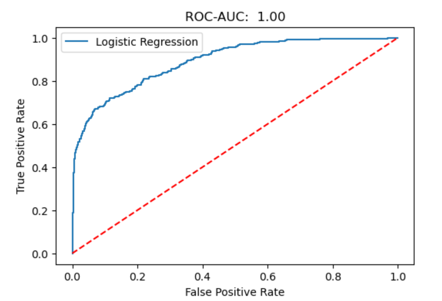

# banking-crisis-prediction
Machine Learning project to predict banking crises using economic indicators
# Banking Crisis Prediction using Machine Learning

## Project Overview
This project predicts banking crises using machine learning models and economic indicators.

## Problem Statement
Banking crises can severely impact the economy. The goal of this project is to predict the likelihood of a banking crisis using economic indicators.

## Models Used
- Logistic Regression
- Random Forest Classifier
- Gradient Boosting Classifier

## Key Results
Tree-based models performed very well in predicting banking crises.

## Top Important Features
- loss
- loss2
- GDPgr
- stmkcap
- pcrdbofgdp

  ## Model Performance (ROC Curve)

The ROC curve shows the performance of the classification model in distinguishing between banking crisis and non-crisis cases.

The model achieved a very high ROC-AUC score, indicating excellent classification performance.

## Dataset
The dataset contains economic indicators used to predict banking crises.

## Project Structure
banking-crisis-prediction  
 Banking_crisis_prediction.ipynb  
finaldataset_1.csv  
README.md
